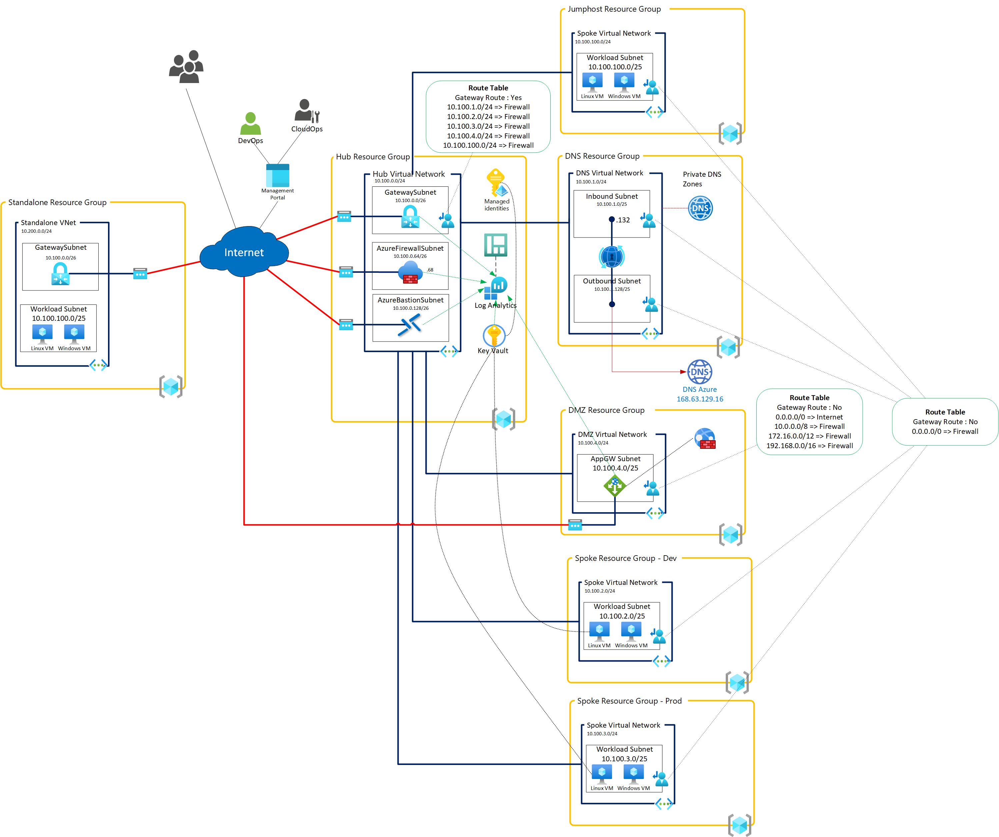
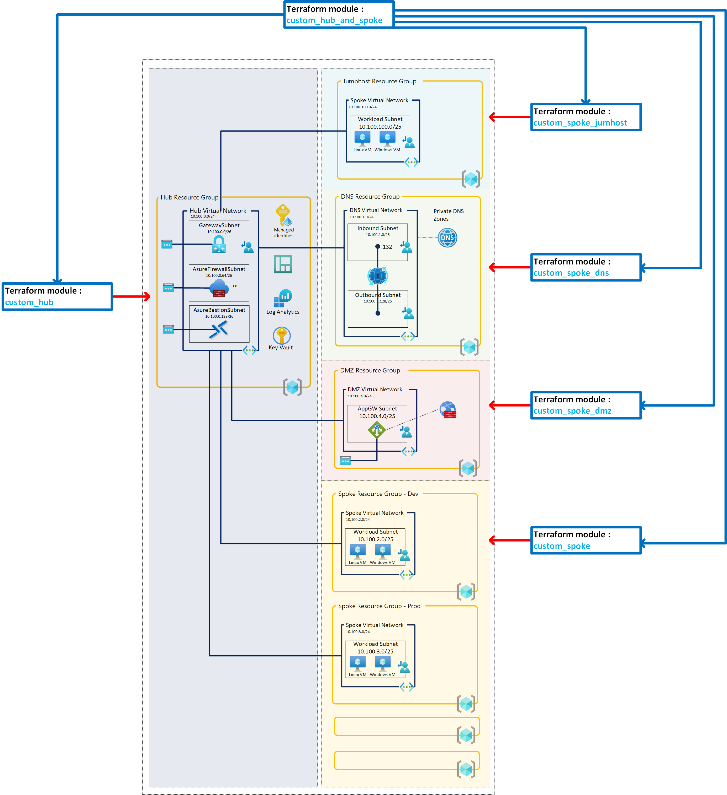
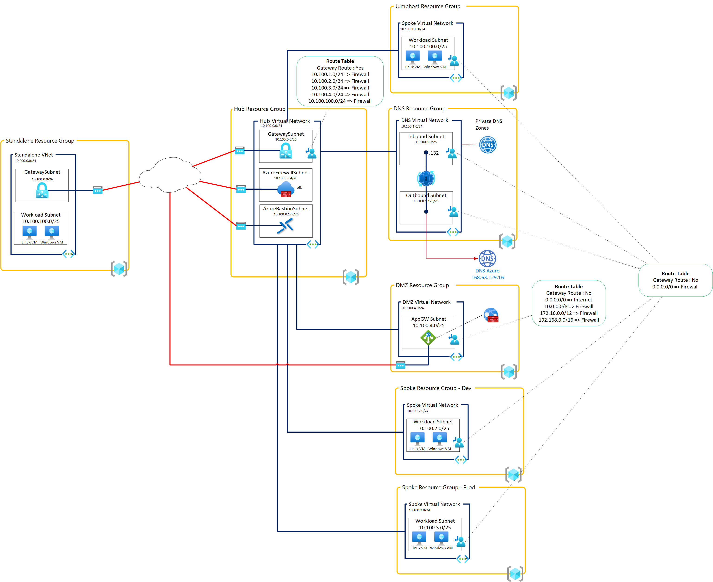

<!-- BEGIN_TF_DOCS -->
# Terraform Azure Resources
[](LICENSE) [](https://registry.terraform.io/modules/azurerm/resources/azure/latest/)

## Overview

This set of terraform modules will help you to create and manage a Azure Resources.

It can help you to create a Azure Resources with a simple way. 
Resources are available in the [Terraform Registry](https://registry.terraform.io/modules/azurerm/resources/azure/latest/).

Unit modules are available in the [modules](modules) directory based on the resource name.  
Composable/pattern modules are available in the [modules](modules) directory with pattern prefix.

The main goal of this set was to deploy a full Hub and Spoke architecture based on best practices and my own experience. Naming of the resource is based on [Azure naming convention](https://learn.microsoft.com/en-us/azure/cloud-adoption-framework/ready/azure-best-practices/resource-naming).

The gouvernance is not managed (yet) by this set of modules.



Depending of your needs, you can include or not the following resources:
- [Virtual Network Gateway](https://docs.microsoft.com/en-us/azure/vpn-gateway/) to connect to on-premise network
- [Azure Firewall](https://docs.microsoft.com/en-us/azure/firewall/) to control network traffic
- [Azure Bastion](https://docs.microsoft.com/en-us/azure/bastion/) to access to Virtual Machine
- [Azure Application Gateway](https://docs.microsoft.com/en-us/azure/application-gateway/) to expose web application
- [Azure Private DNS Resolver](https://learn.microsoft.com/en-us/azure/dns/dns-private-resolver-overview)
- [Spoke Jump Host](https://docs.microsoft.com/en-us/azure/architecture/reference-architectures/hybrid-networking/jumphost) accessible from the Internet through Azure Firewall
- [Spokes](https://docs.microsoft.com/en-us/azure/architecture/reference-architectures/hybrid-networking/hub-spoke) with [Virtual Machine](https://docs.microsoft.com/en-us/azure/virtual-machines/)
- [Key Vault](https://docs.microsoft.com/en-us/azure/key-vault/) to store secrets (passwords, certificates, ...)

## Limitations

- Single subscription
- No vWAN (Virtual WAN) support
- No gouvernance (Azure Policy, ...)
- No Network Security Group (NSG), security rules are managed by Azure Firewall
- All logs and all metrics are sent to Log Analytics Workspace

## Terraform modules


You can find all modules in the [modules](modules) directory.
One example is available below.

## Network design

The network design is based on [Hub and Spoke](https://docs.microsoft.com/en-us/azure/architecture/reference-architectures/hybrid-networking/hub-spoke) architecture. Routing is managed by [User Defined Route](https://docs.microsoft.com/en-us/azure/virtual-network/virtual-networks-udr-overview) (UDR) and [Azure Firewall](https://docs.microsoft.com/en-us/azure/firewall/overview).



## Example

```hcl
terraform {
  required_version = ">= 1.0.0"
  required_providers {
    azurerm = {
      source  = "hashicorp/azurerm"
      version = ">=4.0.0"
    }
  }
}

provider "azurerm" {
  features {}
}

module "hub_and_spoke" {
  source                                 = "azurerm/resources/azure//modules/pattern_hub_and_spoke"
  location                               = "francecentral"
  firewall                               = true
  gateway                                = true
  bastion                                = true
  address_space_hub                      = ["10.100.0.0/24"]
  spoke_dns                              = true
  address_space_spoke_dns                = ["10.100.1.0/24"]
  spoke_dmz                              = true
  address_space_spoke_dmz                = ["10.100.2.0/24"]
  web_application_firewall               = true
  private_monitoring                     = true
  address_space_spoke_private_monitoring = ["10.100.3.0/27"]
  connection_monitor                     = true
  update_management                      = true
  address_space_spokes = [
    {
      workload        = "shared"
      environment     = "prd"
      instance        = "001"
      address_space   = ["10.100.5.0/24"]
      virtual_machine = false
    },
    {
      workload        = "app1"
      environment     = "dev"
      instance        = "001"
      address_space   = ["10.100.10.0/24"]
      virtual_machine = true
    }
  ]
}
```

## Requirements

- **Network Watcher**: Ensure that a Network Watcher is deployed in the Azure region where the resources will be created. If a Network Watcher does not exist, you can create one manually or include it in your Terraform configuration.
  - [Azure Network Watcher Documentation](https://learn.microsoft.com/en-us/azure/network-watcher/network-watcher-monitoring-overview)

- **Terraform State Variables**: The following variables must be set as **GitHub Variables** in your repository to configure the Terraform backend:
  - `TFSTATE_RESOURCE_GROUP`: The name of the resource group containing the storage account for the Terraform state.
  - `TFSTATE_STORAGE_ACCOUNT`: The name of the storage account used for storing the Terraform state.
  - `TFSTATE_CONTAINER`: The name of the blob container where the state file is stored.
  - `TFSTATE_KEY`: The key (name) of the state file.
  - `ADDITIONAL_ACCESS_POLICY_OBJECT_IDS` : This variable should contain a list of Entra ID (Azure AD) object IDs that require access to the Key Vault data plane.


  Ensure these variables are set in the **GitHub Variables** section of your repository. You can configure them by navigating to:
  - **Settings** > **Variables and secrets** > **Actions** > **Variables**.

  - [GitHub Variables Documentation](https://docs.github.com/en/actions/learn-github-actions/variables)

- **Azure Credentials**: Add `AZURE_CREDENTIALS` as a **GitHub Secret** in your repository. This secret should contain the Azure service principal credentials in JSON format. You can configure it by navigating to:
  - **Settings** > **Variables and secrets** > **Actions** > **Secrets**.

  Example JSON format for `AZURE_CREDENTIALS`:
  ```json
  {
    "clientId": "xxxxxxxx-xxxx-xxxx-xxxx-xxxxxxxxxxxx",
    "clientSecret": "xxxxxxxxxxxxxxxxxxxxxxxxxxxxxxxx",
    "subscriptionId": "xxxxxxxx-xxxx-xxxx-xxxx-xxxxxxxxxxxx",
    "tenantId": "xxxxxxxx-xxxx-xxxx-xxxx-xxxxxxxxxxxx"
  }
  ```

  - [GitHub Secrets Documentation](https://docs.github.com/en/actions/security-guides/encrypted-secrets)

## Providers

No providers.

## Modules

No modules.

## Resources

No resources.

## Inputs

No inputs.

## Outputs

No outputs.
<!-- END_TF_DOCS -->